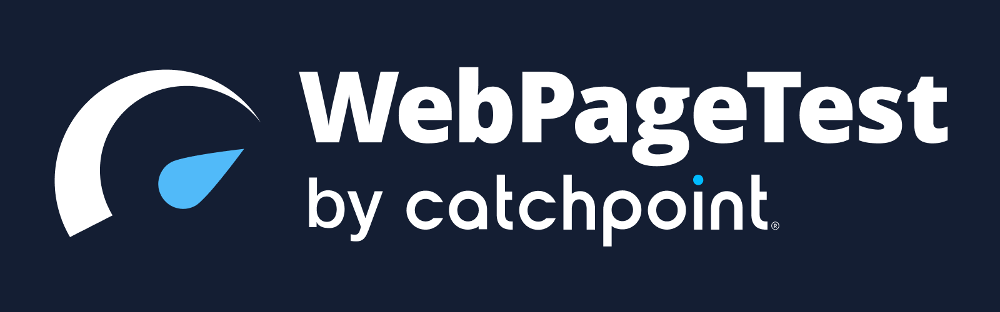

<p align="center"></p>
<h1 align="center">
WebPageTest API Recipes
</h1>
<p align="center" style="font-size: 1.2rem;">
👩‍🍳 A collection of useful recipes for the <a href="https://github.com/WebPageTest/webpagetest-api">WebPageTest API</a>
</p>
<p align="center" style="font-size: 1.2rem;">🍔 What's your favorite recipe?</p>

## 📖Table Of Contents

- [Emulate a slow network](#emulate-a-slow-network)
- [Emulate a slow network and CPU throttling](#emulate-network-&-cputhrottle)
- [Emulate a custom connectivity (Bandwidth, Latency, PacketLossRate)](#emulate-a-custom-connectivity)
- [Retrieve your Core Web Vitals](#retrieve-your-core-web-vitals)
- [Retrieve your Core Web Vitals + CrUX data for the tested URL](#retrieve-your-core-web-vitals-+-crux)
- [Run a test with a third-party domain blocked](#run-a-test-with-a-third-party-domain-blocked)
- [Run a test and get the filmstrip screenshots](#run-a-test-and-get-the-filmstrip-screenshots)
- [Run a test and generate a lighthouse report](#run-a-test-and-generate-a-lighthouse-report)
- [Run a multi-step test with scripting](#run-a-multi-step-test-with-scripting)
- [Run a test and generate a waterfall image](#run-a-test-and-generate-a-waterfall-image)
- [Run tests on multiple URLs](#run-tests-on-multiple-urls)
- [Create a URL endpoint](#create-a-url-endpoint)
- [Run a test and check a budget using testspecs](#run-a-test-and-check-a-budget-using-testspecs)
- [Run a test using webpagetest chrome recorder](#run-a-test-using-webpagetest-chrome-recorder)

<h3 id="emulate-a-slow-network">Emulate a slow network</h3>

```js
import WebPageTest from "webpagetest";

const wpt = new WebPageTest("https://www.webpagetest.org", "YOUR_API_KEY");

let testURL = "https://docs.webpagetest.org/"; //Your URL here

// Simulated network throttling (Slow 3G)
let options = {
  location: "Dulles:Chrome", //mandatory with connectivity
  connectivity: "3G",
};

// Run the test
wpt.runTest(testURL, options, (err, result) => {
  if (result) {
    console.log(result);
  } else {
    console.log(err);
  }
});

```


[Source](slow-network.js)

<h3 id="emulate-network-&-cputhrottle">Emulate a slow network and CPU throttling</h3>

```js
import WebPageTest from "webpagetest";

const wpt = new WebPageTest("https://www.webpagetest.org", "YOUR_API_KEY");

let testURL = "https://docs.webpagetest.org/"; //Your URL here

// Simulated network & cpu throttling
let options = {
  location: "Dulles:Chrome",
  connectivity: "3G",
  throttleCPU: 5,
};

// Run the test
wpt.runTest(testURL, options, (err, result) => {
  if (result) {
    console.log(result);
  } else {
    console.log(err);
  }
});


```

[Source](network-and-cpu-throttling.js)

<h3 id="emulate-a-custom-connectivity">Emulate a custom connectivity (Bandwidth, Latency, PacketLossRate)</h3>

```js
import WebPageTest from "webpagetest";

const wpt = new WebPageTest("https://www.webpagetest.org", "YOUR_API_KEY");

let testURL = "https://docs.webpagetest.org/"; //Your URL here

// Simulated custom connectivity options (custom)
let options = {
  connectivity: "custom",
  location: "ec2-us-east-1:Chrome",
  label: "custom connectivity",
  bandwidthDown: 1000,
  bandwidthUp: 1000,
  latency: 5,
  packetLossRate: 5,
};

// Run the test
wpt.runTest(testURL, options, (err, result) => {
  if (result) {
    console.log(result);
  } else {
    console.log(err);
  }
});

```

[Source](connectivity-custom.js)

<h3 id="retrieve-your-core-web-vitals">Retrieve your Core Web Vitals</h3>

```js
import WebPageTest from "webpagetest";

const wpt = new WebPageTest("https://www.webpagetest.org", "YOUR_API_KEY");

let testURL = "https://docs.webpagetest.org/"; //Your URL here

let options = {
  firstViewOnly: true,
  location: "Dulles:Chrome",
  pollResults: 5,
  timeout: 240,
};

wpt.runTest(testURL, options, (err, result) => {
  if (result) {
    console.log({
      CumulativeLayoutShift: result.data.average.firstView["chromeUserTiming.CumulativeLayoutShift"],
      LargestContentfulPaint: result.data.average.firstView["chromeUserTiming.LargestContentfulPaint"],
      TotalBlockingTime: result.data.average.firstView["TotalBlockingTime"],
    });
  } else {
    console.log(err);
  }
});


```


[Source](webvitals.js)


<h3 id="retrieve-your-core-web-vitals-+-crux">Retrieve your Core Web Vitals + CrUX data for the tested URL</h3>

```js
import WebPageTest from "webpagetest";

const wpt = new WebPageTest("https://www.webpagetest.org", "YOUR_API_KEY");

let testURL = "https://www.webpagetest.org/"; //Your URL here

let options = {
  firstViewOnly: true,
  location: "Dulles:Chrome",
  pollResults: 5,
  timeout: 240,
};

wpt.runTest(testURL, options, (err, result) => {
  if (result) {
    console.log("<-------------Core Web Vitals------------->");
    console.log({
      CumulativeLayoutShift: result.data.average.firstView["chromeUserTiming.CumulativeLayoutShift"],
      LargestContentfulPaint: result.data.average.firstView["chromeUserTiming.LargestContentfulPaint"],
      TotalBlockingTime: result.data.average.firstView["TotalBlockingTime"],
    });

    if (result.data.median.firstView.CrUX !== undefined) {
      console.log("<----------------Crux Data---------------->");
      console.log(result.data.median.firstView.CrUX);
    } else {
      console.log("No CrUX Data Found");
    }
  } else {
    console.log(err);
  }
});

```


[Source](webvitals-crux.js)

<h3 id="run-a-test-with-a-third-party-domain-blocked">Run a test with a third-party domain blocked</h3>

```js
import WebPageTest from "webpagetest";

const wpt = new WebPageTest("https://www.webpagetest.org", "YOUR_API_KEY");

let testURL = "https://theverge.com"; //Your URL here

// URL's must be seprated by spaces (space-delimited)
let options = {
  block:
    "https://pagead2.googlesyndication.com https://creativecdn.com https://www.googletagmanager.com https://cdn.krxd.net https://adservice.google.com https://cdn.concert.io https://z.moatads.com https://cdn.permutive.com",
};

// Run the test
wpt.runTest(testURL, options, (err, result) => {
  if (result) {
    console.log(result);
  } else {
    console.log(err);
  }
});

```

[Source](third-party-domain-blocked.js)

<h3 id="run-a-test-and-get-the-filmstrip-screenshots">Run a test and get the filmstrip screenshots</h3>

```js
import WebPageTest from "webpagetest";
import fs from "fs";
import axios from "axios";

const wpt = new WebPageTest("https://www.webpagetest.org", "YOUR_API_KEY");

let testURL = "https://docs.webpagetest.org/"; //Your URL here

let options = {
  firstViewOnly: true,
  location: "Dulles:Chrome",
  connectivity: "4G",
  pollResults: 5, //keep polling for results after test is scheduled
};

wpt.runTest(testURL, options, (err, result) => {
  if (result) {
    result.data.median.firstView.videoFrames.forEach((item, index) => {
      axios({
        method: "get",
        url: item.image,
        responseType: "stream",
      }).then(function (response) {
        response.data.pipe(fs.createWriteStream(`screenshot-${index}.png`));
      });
    });
  } else {
    console.log(err);
  }
});

```


[Source](screenshot-strip.js)

<h3 id="run-a-test-and-generate-a-lighthouse-report">Run a test and generate a lighthouse report</h3>

```js
import WebPageTest from "webpagetest";

const wpt = new WebPageTest("https://www.webpagetest.org", "YOUR_API_KEY");

let testURL = "https://docs.webpagetest.org/"; //Your URL here

let options = {
  pollResults: 5,
  timeout: 240,
  lighthouse: 1, // This parameter will generate both WPT results and Lighthouse report
};

// Run the test
wpt.runTest(testURL, options, (err, result) => {
  if (result) {
    console.log(`\n
      Lighthouse scores:
       Performance: ${result.data.lighthouse.categories.performance.score * 100},
       Accessibility: ${result.data.lighthouse.categories.accessibility.score * 100},
       Best Practices: ${result.data.lighthouse.categories['best-practices'].score * 100},
       SEO: ${result.data.lighthouse.categories.seo.score * 100},
       PWA: ${result.data.lighthouse.categories.pwa.score * 100}

      Lighthouse report: https://www.webpagetest.org/lighthouse.php?test=${result.data.id}
      Full WebPageTest results: ${result.data.summary}
    `);
  } else {
    console.log(err);
  }
});

```


[Source](lighthouse.js)

<h3 id="run-a-multi-step-test-with-scripting">Run a multi-step test with scripting</h3>

```js
import WebPageTest from "webpagetest";

const wpt = new WebPageTest("https://www.webpagetest.org", "YOUR_API_KEY");

let options = {
  pollResults: 5,
  firstViewOnly: true, //Skips the Repeat View test
};

const script = wpt.scriptToString([
  { logData: 0 },
  { navigate: "http://foo.com/login" },
  { logData: 1 },
  { setValue: ["name=username", "johndoe"] },
  { setValue: ["name=password", "12345"] },
  { submitForm: "action=http://foo.com/main" },
  "waitForComplete",
]);

// Run the test
wpt.runTest(script, options, (err, result) => {
  if (result) {
    console.log(result);
  } else {
    console.log(err);
  }
});

```

Visit [Scripting Docs](https://docs.webpagetest.org/scripting/) for more information 

[Source](multistep.js)


<h3 id="run-a-test-and-generate-a-waterfall-image">Run a test and generate a waterfall image</h3>

```js
import WebPageTest from "webpagetest";
import fs from "fs";
import axios from "axios";

const wpt = new WebPageTest("https://www.webpagetest.org", "YOUR_API_KEY");

let testURL = "https://docs.webpagetest.org/"; //Your URL here

let options = {
  firstViewOnly: true,
  location: "Dulles:Chrome",
  connectivity: "4G",
  pollResults: 5, //keep polling for results after test is scheduled
};

wpt.runTest(testURL, options, (err, result) => {
  if (result) {
    let imgurl = result.data.median.firstView.images.waterfall;

    axios({
      method: "get",
      url: imgurl,
      responseType: "stream",
    }).then(function (response) {
      response.data.pipe(fs.createWriteStream("waterfall.png"));
    });
  } else {
    console.log(err);
  }
});

```


[Source](waterfall-image.js)

<h3 id="run-tests-on-multiple-urls">Run tests on multiple URLs</h3>

```js
import WebPageTest from "webpagetest";

const wpt = new WebPageTest("www.webpagetest.org", "YOUR_API_KEY");
const finalResults = [];

// Your list of URLs to test
let urls = [
  "https://www.webpagetest.org/",
  "https://www.product.webpagetest.org/api",
  "https://docs.webpagetest.org/api/",
  "https://blog.webpagetest.org/",
  "https://www.webpagetest.org/about",
];

let options = {
  firstViewOnly: true,
  location: "Dulles:Chrome",
  connectivity: "4G",
  pollResults: 5,
  timeout: 240,
};

const runTest = (wpt, url, options) => {
  return new Promise((resolve, reject) => {
    console.log(`Submitting test for ${url}...`);
    wpt.runTest(url, options, async (err, result) => {
      try {
        if (result) {
          return resolve(result);
        } else {
          return reject(err);
        }
      } catch (e) {
        console.info(e);
      }
    });
  });
};

(async function () {
  Promise.all(
    urls.map(async (url) => {
      try {
        await runTest(wpt, url, options).then(async (result) => {
          if (result.data) {
            let median = result.data.median.firstView;
            //Pushing the data into the Array
            finalResults.push({
              id: result.data.id,
              url: result.data.url,
              cls: median["chromeUserTiming.CumulativeLayoutShift"],
              lcp: median["chromeUserTiming.LargestContentfulPaint"],
              tbt: median["TotalBlockingTime"],
            });
          }
        });
      } catch (e) {
        console.error(e);
      }
    })
  ).then(() => {
    console.info(finalResults);
  });
})();

```


[Source](bulk-tests.js)

<h3 id="create-a-url-endpoint">Create a URL endpoint</h3>

```js
import WebPageTest from "webpagetest";

const wpt = new WebPageTest("https://www.webpagetest.org", "YOUR_API_KEY");

let options = {
  dryRun: true, // outputs the api endpoint
};

// multistep script
const script = wpt.scriptToString([
  { navigate: 'https://timkadlec.com/' },
  { execAndWait: 'document.querySelector("#nav > ul > li:nth-child(2) > a").click();' },
  { execAndWait: 'document.querySelector("#nav > ul > li:nth-child(3) > a").click();' },
  { execAndWait: 'document.querySelector("#nav > ul > li:nth-child(4) > a").click();' },
]);

// fire up the runtest function with a script or a url
wpt.runTest(script, options, (err, result) => {
  if (result) {
    console.log(result);
  } else {
    console.log(err);
  }
});


```


[Source](dryrun.js)

<h3 id="run-a-test-and-check-a-budget-using-testspecs">Run a test and check a budget using testspecs</h3>

```js
import WebPageTest from "webpagetest";

const wpt = new WebPageTest("https://www.webpagetest.org", "YOUR_API_KEY");

let testURL = "https://docs.webpagetest.org/"; //Your URL here

let options = {
  firstViewOnly: true,
  location: "Dulles:Chrome",
  pollResults: 5,
  timeout: 240,
  // Set you budget specs here
  specs: {
    average: {
      firstView: {
        "chromeUserTiming.CumulativeLayoutShift": 0.1,
        "chromeUserTiming.LargestContentfulPaint": 2500,
        firstContentfulPaint: 2000,
        TotalBlockingTime: 0.1,
      },
    },
  },
};

wpt.runTest(testURL, options, (err, result) => {
  if (result) {
    console.log(`Your results are here for test ID:- ${result.testId}`);
  } else {
    console.log(err);
  }
});

```


Check [Testspecs](https://github.com/WebPageTest/webpagetest-api/wiki/Test-Specs) for more details on setting a budget

[Source](testspecs.js)

<h3 id="run-a-test-using-webpagetest-chrome-recorder">Run a test using webpagetest chrome recorder</h3>

```js
import WebPageTest from "webpagetest";
import { WPTStringifyChromeRecording } from "webpagetest-chrome-recorder";

//Recording generated using chrome recorder
const recordingContent = {
  title: "Webpagetest Chrome Recorder",
  steps: [
    {
      type: "setViewport",
      width: 1263,
      height: 600,
      deviceScaleFactor: 1,
      isMobile: false,
      hasTouch: false,
      isLandscape: false,
    },
    {
      type: "navigate",
      url: "https://blog.webpagetest.org/",
      assertedEvents: [
        {
          type: "navigation",
          url: "https://blog.webpagetest.org/",
          title: "WebPageTest Blog",
        },
      ],
    },
    {
      type: "click",
      target: "main",
      selectors: [["header li:nth-of-type(2) > a"]],
      offsetY: 27.802078247070312,
      offsetX: 26.427078247070312,
      assertedEvents: [
        {
          type: "navigation",
          url: "https://blog.webpagetest.org/categories/webpagetest-news/",
          title: "",
        },
      ],
    },
  ],
};

//Converting json recording to webpagetest script
const script = await WPTStringifyChromeRecording(recordingContent);
console.log("Stringified Webpagetest Recorder Script: \n\n" + script + "\n");

// Initializing webpagetest
const wpt = new WebPageTest("https://www.webpagetest.org", "YOUR_API_KEY");

let options = {
  firstViewOnly: true,
  label: recordingContent.title,
};

console.log("Webpagetest Custom Script Test Result: \n");

// Run the test using webpagetest script
wpt.runTest(script, options, (err, result) => {
  if (result) {
    console.log(result);
  } else {
    console.log(err);
  }
});

```


Check [Webpagetest Chrome Recorder](https://github.com/WebPageTest/Recorder-To-WPT-Script) for more details

[Source](webpagetest-chrome-recorder.js)